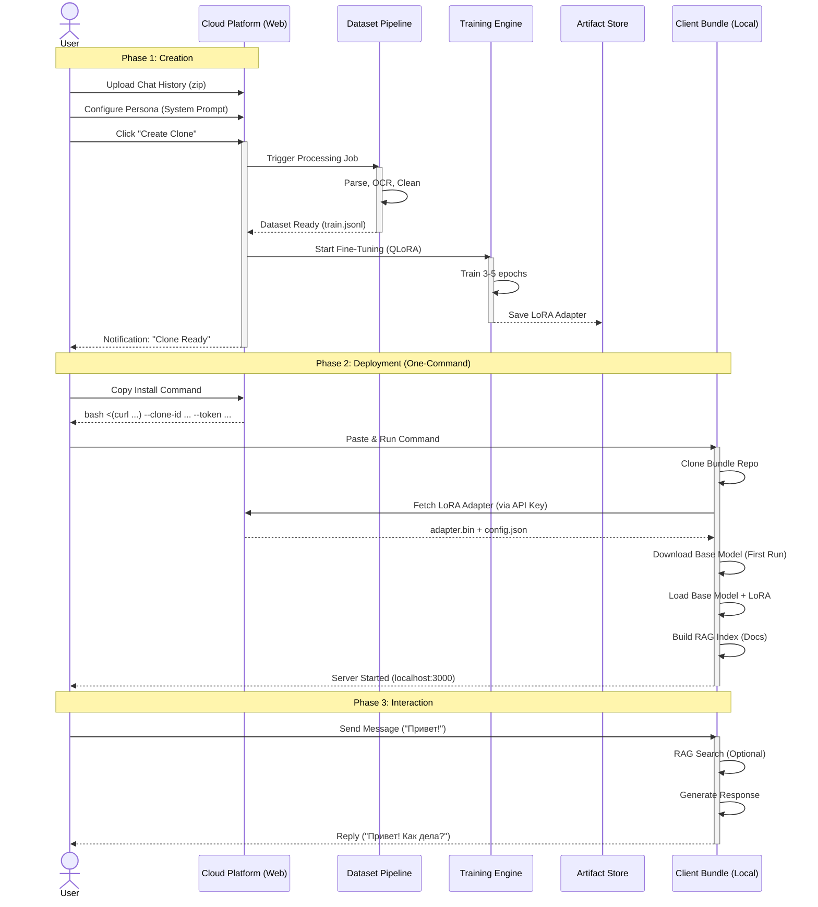

# High Level Design (HLD): AI Clone Platform

## 1. Executive Summary

Платформа **AI Clone** предоставляет полный цикл создания цифровых двойников: от сбора данных и обучения в облаке до автономного запуска на стороне клиента. Архитектура построена на принципе разделения сред: ресурсоемкое обучение происходит на серверах платформы, а инференс (использование) — локально у пользователя или на его выделенном сервере, обеспечивая приватность и независимость.

## 2. System Architecture

Система разделена на два физически изолированных контура: **Cloud Platform** (Обучение) и **Client Environment** (Использование).

```mermaid
graph TB
    subgraph "Cloud Platform (Training Zone)"
        direction TB
        WebUI[Web Dashboard\n(Next.js)]
        Orchestrator[Training Orchestrator\n(API / Job Queue)]
        
        subgraph "Data Processing"
            Ingest[Data Ingestion]
            Pipeline[Dataset Pipeline\n(ETL & OCR)]
            CleanData[(Processed Dataset\nJSONL)]
        end
        
        subgraph "Training Cluster"
            Trainer[QLoRA Trainer\n(Python/PyTorch)]
            BaseModel_Cloud[Base Model\n(Qwen2.5-VL)]
        end
        
        ArtifactStore[Artifact Store\n(LoRA Adapters & Configs)]
    end

    subgraph "Client Environment (Inference Zone)"
        direction TB
        Bundle[AI Clone Bundle\n(Zip/Docker)]
        
        subgraph "Local Runtime"
            InferenceServer[Inference Server\n(FastAPI)]
            LocalModel[Base Model + LoRA]
            RAG[RAG Engine\n(ChromaDB)]
        end
        
        ClientUI[Local Web Chat]
        TGBot[Telegram Bot]
    end

    %% Flows
    User((User)) -->|1. Upload Chats| WebUI
    WebUI -->|2. Start Job| Orchestrator
    Orchestrator --> Pipeline
    Pipeline --> CleanData
    CleanData --> Trainer
    BaseModel_Cloud -.-> Trainer
    Trainer -->|3. Save Adapter| ArtifactStore
    
    ArtifactStore -->|4. Download Bundle| Bundle
    Bundle -->|5. Install & Run| LocalRuntime
    
    User -->|6. Chat| ClientUI
    User -->|7. Chat| TGBot
    TGBot --> InferenceServer
    ClientUI --> InferenceServer
    InferenceServer --> LocalModel
    InferenceServer <--> RAG
```

### 2.1. Cloud Platform (Training Zone)
Централизованная среда для подготовки клона.
*   **Web Dashboard**: Интерфейс для загрузки архивов (Telegram/WhatsApp), настройки "личности" и мониторинга прогресса.
*   **Dataset Pipeline**: Конвейер обработки данных. Превращает сырые логи чатов и документы в формат для обучения, используя OCR для картинок.
*   **Training Cluster**: GPU-кластер, где запускается скрипт `train_qlora.py`. Создает LoRA-адаптер — "душу" клона (файл весом ~100-200MB).
*   **Artifact Store**: Хранилище готовых адаптеров, доступных для скачивания.

### 2.2. Client Environment (Inference Zone)
Автономная среда исполнения.
*   **AI Clone Bundle**: "Коробочное" решение. Содержит сервер, UI и скрипты запуска.
*   **Local Runtime**: При первом запуске скачивает базовую модель (Open Source) и накладывает на неё скачанный с платформы LoRA-адаптер.
*   **Interfaces**: Пользователь общается с клоном через локальный браузер или подключенного Telegram-бота.

## 3. End-to-End Flow (Sequence Diagram)

Процесс создания и использования клона.



## 4. Детальное описание компонентов

### 4.1. Dataset Pipeline (ETL)
*   **Задача**: Извлечь структуру диалогов и знания из хаоса файлов.
*   **Технологии**: Python, Qwen2-VL (OCR), Regex.
*   **Ключевая фича**: *Pure Parsing Pipeline*. Мы не используем LLM для генерации синтетики, мы учим модель на *реальных* паттернах речи пользователя, сохраняя его стиль, ошибки и манеру.

### 4.2. Training Engine
*   **Задача**: Внедрить стиль и знания в модель.
*   **Технологии**: PyTorch, PEFT (LoRA), Transformers.
*   **Метод**: QLoRA (Quantized Low-Rank Adaptation). Позволяет обучать огромные модели (7B+) на доступных GPU, изменяя лишь малую часть весов (адаптер).

### 4.3. Client Bundle
*   **Задача**: Максимально простой запуск для нетехнического пользователя.
*   **Состав**:
    *   **One-Command Deploy**: Пользователь копирует команду с платформы:
        ```bash
        bash <(curl -s https://platform.com/install_clone.sh) \
          --clone-id <CLONE_ID> \
          --token <API_KEY>
        ```
    *   **Dynamic Fetch**: Скрипт установки автоматически:
        1.  Клонирует репозиторий бандла.
        2.  Скачивает специфичный LoRA-адаптер и конфиги для указанного `CLONE_ID` с защищенного API.
        3.  Настраивает окружение и запускает сервер.
    *   **Принцип**: "Bring Your Own Compute". Клиент использует свое железо (или арендованный сервер), данные не покидают его контур при инференсе.

## 5. Технические требования

| Компонент | Требования | Примечание |
| :--- | :--- | :--- |
| **Cloud Platform** | GPU A100/H100 (Training) | Для быстрого обучения (15-30 мин на клона). |
| **Client Local** | GPU 12GB+ VRAM (NVIDIA) | Для комфортного общения (токенов/сек). |
| **Client Local (Min)** | CPU + 16GB RAM | Работает, но медленно (1-2 слова/сек). |

## 6. Безопасность и Приватность

1.  **Data Isolation**: Сырые данные удаляются с Cloud Platform сразу после подготовки датасета (опционально) или хранятся в зашифрованном виде.
2.  **Model Ownership**: LoRA-адаптер принадлежит пользователю.
3.  **Local Inference**: При использовании Bundle запросы не уходят в интернет (кроме Telegram API, если включен бот).
